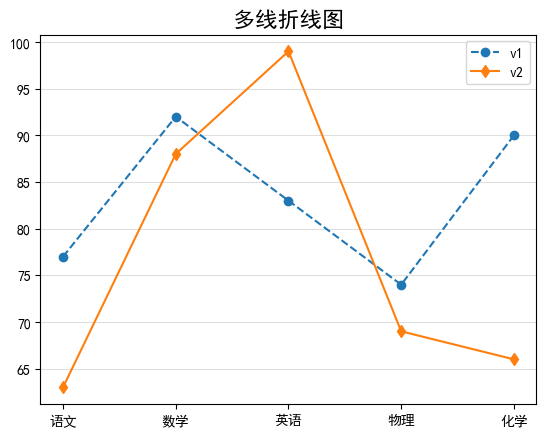
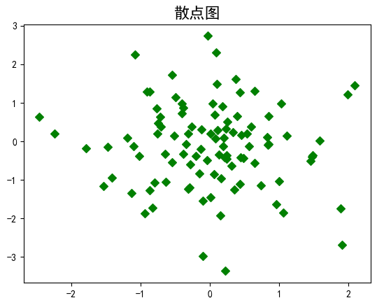
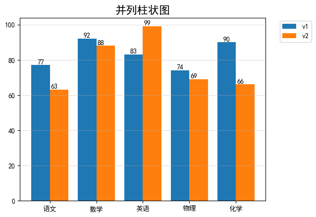
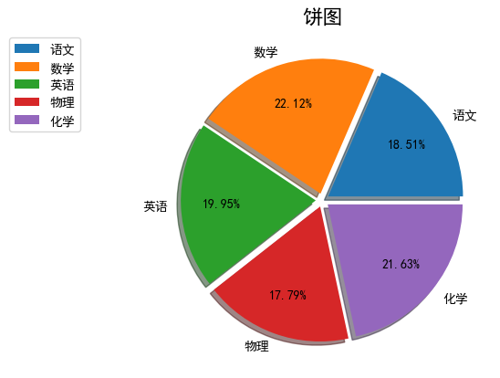
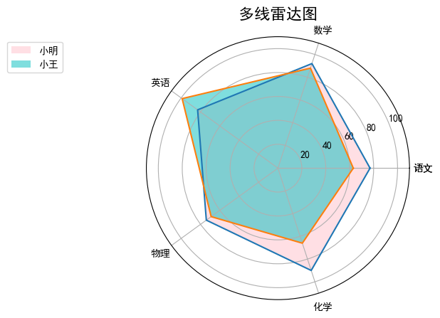

# matplotlib-project

## 项目简介

该项目是一个基于 Matplotlib 库的数据可视化示例集合，通过 Jupyter Notebook 进行展示。本项目旨在为使用 Matplotlib 进行数据可视化的初学者和专业人士提供示例代码和案例。通过这些案例，您可以学习如何使用 Matplotlib 创建各种类型的图表，从简单的线性图到复杂的三维图形。

## 示例图表

以下是该项目中包含的一些示例图表：

### 1. 折线图

这个示例展示了如何使用 Matplotlib 创建基本的折线图，用于显示数据随时间的变化趋势。

### 2. 散点图

散点图示例展示了如何用散点图来显示两个变量之间的关系，帮助观察数据的分布和趋势。

### 3. 柱状图

柱状图示例演示了如何使用 Matplotlib 创建柱状图，用于比较不同类别的数据。

### 4. 饼图

这个示例展示了如何使用 Matplotlib 创建饼图，以显示各部分在整体中的占比。

### 5. 雷达图

该示例演示了如何使用 Matplotlib 创建雷达图。

## 使用步骤

1. 安装 Jupyter Notebook，确保已安装 Matplotlib 和相关依赖。
2. 克隆本仓库到您的本地环境`git clone git@github.com:yangyezhuang/matplotlib-demo.git`
3. 进入项目目录，在 Jupyter Notebook 中打开相应的示例文件（例如 line_plot.ipynb）。
4. 执行示例代码块，观察图表效果和代码解释。

## 贡献

如果您有任何对于 Matplotlib 的绘图案例或改进建议，欢迎提出 issue 或提交 pull 请求。我们欢迎各种形式的贡献，以帮助其他开发者更好地学习和使用 Matplotlib。

## 许可证

本项目基于 [MIT 许可证](/LICENSE)，您可以自由地使用、修改和分发本项目的代码。

## 联系我们

如有任何疑问或建议，请通过项目的 Issue 页面与我们取得联系。

**感谢您的光临和支持！**

---

*注意：示例图表仅为展示目的，实际效果可能因数据和定制化而异。*
